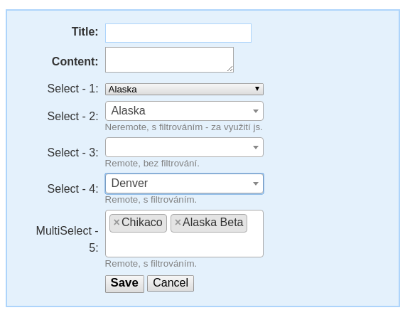

SelectboxRemote
===============

Select, který načítá data vzdáleně. Vhodné pro velké množství data, které chceme filtrovat, a načítat postupně po stránkách.


## Instalace

```
composer require tacoberu/nette-form-selectboxremote
```


## Použití

Tak jak v obyčejném selecboxu předáváte pole hodnot, zde předáváte model poskytující hodnoty.
Jako model může posloužit univerzální `CallbackQueryModel`, který všechno pořeší callbackama. Ale
je možné si vytvořit vhodnou implementaci rozhraní, které poskytuje požadovaná data.

Může to vypadat nějak takto:


### Registrace extension

Přidáme si do kontaineru zkratku `addSelectRemote()` a `addMultiSelectRemote()`:

```
extensions:
	- Taco\Nette\Forms\Controls\SelectBoxRemoteExtension
```


### Javascript

Je třeba přidat obslužný program javascriptu, například:

```html
	<link href="https://cdn.jsdelivr.net/npm/select2@4.0.10/dist/css/select2.min.css" rel="stylesheet" />
	<script src="https://cdn.jsdelivr.net/npm/select2@4.0.10/dist/js/select2.min.js"></script>
	<script type="text/javascript">
		$(function () {

			/**
			 * Support Select2 for SelectBoxRemoteControl.
			 * https://select2.github.io/
			 * @node-attr data-data-url Zdroj dat. { items, isMoreResults }
			 */
			$('select').each(function() {
				if ($(this).data('class') == 'filterable' || $(this).data('type') == 'remoteselect') {
					var opts = {};
					if ($(this).data('type') == 'remoteselect') {
						opts.ajax = {
							url: function() {
								return $(this).data('data-url');
							},
							dataType: 'json',
							delay: 250,
							data: function (params) {
								return {
									term: params.term, // search term
									page: params.page
								};
							},
							processResults: function (data, params) {
								// parse the results into the format expected by Select2
								// since we are using custom formatting functions we do not need to
								// alter the remote JSON data, except to indicate that infinite
								// scrolling can be used
								params.page = params.page || 1;
								return {
									results: data.items.map(function(x) { return {
										id: x.id,
										text: x.label,
									};}),
									pagination: {
										more: (params.page * 10) < data.total
									}
								};
							},

						}
					}
					if ($(this).data('class') != 'filterable') {
						opts.minimumResultsForSearch = -1;
					}
					$(this).select2(opts);
				}
			});

			$.nette.init();
		});
	</script>
```


### Basic usage in PHP

```php
$form = new Nette\Forms\Form;

// CallbackQueryModel is buildin implementation of generic QueryModel.
$categorySelectQueryModel = new CallbackQueryModel(function($term, $page, $pageSize) use ($data) {
	$results = [];
	foreach ($data as $x) {
		if ($term && stripos($x->label, $term) === False) {
			continue;
		}
		$results[] = (object) [
			'id' => $x->id,
			'label' => $x->label,
		];
	}
	$total = count($results);
	$offset = ($page - 1) * $pageSize;
	return (object) [
		'total' => $total,
		'items' => array_slice($results, $offset, $pageSize),
	];
}, function($id) use ($data) {
	foreach ($data as $x) {
		if ($x->id === $id) {
			return $x;
		}
	}
});

$form['category'] = new SelectBoxRemoteControl($categorySelectQueryModel, 'Category:');
$form['tags'] = new MultiSelectBoxRemoteControl($this->getTagSelectQueryModel(), 'Tags:');

```


