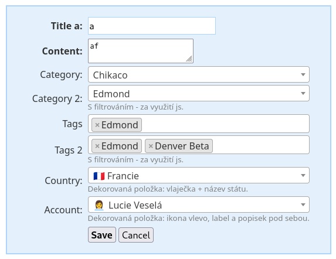
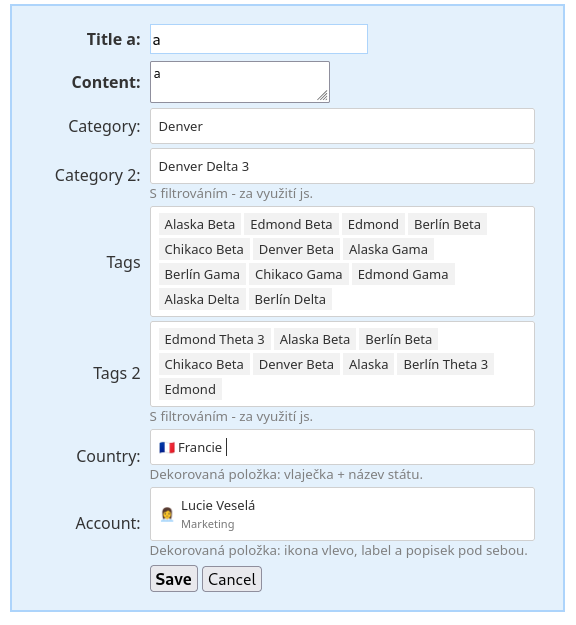

Nette SelectboxRemote
======================

Select, which retrieves data remotely. It's available for large amounts of records that need to be filtered and loaded gradually in pages. The package offers an instant solution for javascript handling via Select2, or TomSelect.

Just as in a regular selectbox an array of values is passed, here a model providing the values is
passed instead. The universal `CallbackQueryModel` can serve as the model, resolving everything via
callbacks. The package also allows you to create your own custom implementation.

All communication with the backend goes through this model in the very same systematic way —
there's no need to create any special AJAX endpoint or presenter action. Loading and filtering data
is handled internally by the control through its own signal, just like any other signal in Nette
components. Adding `addSelectRemote()` is therefore, from a usage point of view, exactly the same as
adding a regular, non-remote selectbox — the only difference is that a model is passed instead of an
array of values.


## Installation

```
composer require tacoberu/nette-form-selectboxremote
```


## Usage

### Register extension

After registering the extension, the `addSelectRemote()` and `addMultiSelectRemote()` shortcuts are
available on the container:

```
extensions:
	- Taco\Nette\Forms\Controls\SelectBoxRemoteExtension
```


### Javascript

The package offers two ready-made handlers, both written in TypeScript and compiled into a JS
module that's part of the package (`vendor/tacoberu/nette-form-selectboxremote/assets/`). The file
is also available directly in the repository and needs to be exposed from your public folder
(symlink or copy) and imported as an ES module. Filtering for a given field is available after
enabling it with the `data-class="filterable"` attribute on the PHP side:

```php
$form->addSelectRemote('category2', 'Category 2:', $model)
	->controlPrototype->data('class', 'filterable');
```

#### Select2

`assets/remoteselect2.ts` → `assets/remoteselect2.js`, the export `initSelect2Impl(el, overrides?)` is available.

```html
	<link href="https://cdn.jsdelivr.net/npm/select2@4.0.10/dist/css/select2.min.css" rel="stylesheet" />
	<script src="https://code.jquery.com/jquery-3.7.1.js"></script>
	<script src="https://cdn.jsdelivr.net/npm/select2@4.0.10/dist/js/select2.min.js"></script>

	<script type="module">
		import { initSelect2Impl } from "/js/remoteselect2.js";
		document.querySelectorAll('select')
			.forEach(initSelect2Impl);
	</script>
```

jQuery is only needed as a dependency of Select2 itself (it's only available as a jQuery plugin) —
the `initSelect2Impl` function itself does not depend on jQuery, it reads attributes through the
native `element.dataset`. Pagination is available thanks to Select2's built-in
`ajax`/`pagination.more` mechanism.

#### TomSelect

`assets/TomSelectAdapter.ts` → `assets/TomSelectAdapter.js`, the export `initTomSelectImpl(el, overrides?)` is available.
Unlike Select2, TomSelect is available as a pure vanilla JS solution, with no dependency on jQuery.

```html
	<link href="https://cdn.jsdelivr.net/npm/tom-select@2.6.1/dist/css/tom-select.css" rel="stylesheet" />
	<script src="https://cdn.jsdelivr.net/npm/tom-select@2.6.1/dist/js/tom-select.complete.min.js"></script>

	<script type="module">
		import { initTomSelectImpl } from "/js/TomSelectAdapter.js";
		document.querySelectorAll('select')
			.forEach(initTomSelectImpl);
	</script>
```

Pagination is available thanks to the official `virtual_scroll` plugin (included in
`tom-select.complete.min.js`) and is switched on automatically for fields with
`data-type="remoteselect"`.

#### Further configuration (overrides)

Both functions, `initSelect2Impl` and `initTomSelectImpl`, offer a second, optional parameter — an
object that gets merged with the automatically derived settings. This makes any other feature of
the given library available, for example reordering items in a multiselect (the `drag_drop` plugin
for TomSelect) or the ability to add a new record (`tags: true` for Select2, `create: true` for
TomSelect):

```js
document.querySelectorAll('select').forEach((el) => {
	const overrides = el.multiple ? { plugins: ['drag_drop'], create: true } : {};
	initTomSelectImpl(el, overrides);
});
```

For TomSelect, `plugins` from the overrides are merged with `virtual_scroll`, which cannot be
disabled — without it, pagination over AJAX would not be available.

#### Decorating items

The model can return arbitrary extra fields per item on top of `id`/`label` (e.g. `flag`, `icon`,
`description`) — the library passes them through unchanged all the way to the JS layer. Rendering
them (an icon, a flag, a description under the label, ...) is then up to your own template
callback, enabled through the same `overrides` parameter:

```js
// Select2: templateResult/templateSelection receive the whole item object.
initSelect2Impl(el, {
	templateResult: (data) => `${data.flag ?? ''} ${data.label}`,
});

// TomSelect: render.option/render.item receive the item object and an escape() helper.
initTomSelectImpl(el, {
	render: { option: (data, escape) => `<div>${escape(data.flag ?? '')} ${escape(data.label)}</div>` },
});
```

The example application demonstrates this on the `countries` field (flag + country name) and the
`accounts` field (icon on the left, label and description stacked below it) — see
`DashboardPresenter::getCountrySelectModel()` / `getAccountSelectModel()` and the corresponding
`<script type="module">` in `select2.latte` / `tomselect.latte`.


### Usage in PHP

```php
$form = new Nette\Forms\Form;

// CallbackQueryModel is buildin implementation of generic QueryModel.
$categorySelectQueryModel = new CallbackQueryModel(function($term, $page, $pageSize) use ($data) {
	$results = [];
	foreach ($data as $x) {
		if ($term && stripos($x->label, $term) === False) {
			continue;
		}
		$results[] = (object) [
			'id' => $x->id,
			'label' => $x->label,
		];
	}
	$total = count($results);
	$offset = ($page - 1) * $pageSize;
	return (object) [
		'total' => $total,
		'items' => array_slice($results, $offset, $pageSize),
	];
}, function($id) use ($data) {
	foreach ($data as $x) {
		if ($x->id === $id) {
			return (array) $x;
		}
	}
	return NULL;
});

// ...

$form->addSelectRemote('category', 'Category:', $categorySelectQueryModel);
$form->addMultiSelectRemote('tags', 'Tags:', $tagsSelectQueryModel);
```






## Example application

`examples/` contains a complete sample Nette application with two pages —
`/dashboard/select2` and `/dashboard/tomselect` — demonstrating the same PHP form handled by both
JS libraries.

```bash
composer install
cp .env-example .env
php -S localhost:8001 examples/document_root/router.php
```

The application is then available at the address from `.env` (`APP_URL`).


## Building assets (TypeScript)

```bash
npm run build:assets
```

The command compiles every `*.ts` file in `assets/` (currently `remoteselect2.ts` and
`TomSelectAdapter.ts`) into the matching `.js` file next to it.


## E2E tests (Playwright)

```bash
npm install
npx playwright install chromium  # first time only

npm run test:e2e        # run the tests
npm run test:e2e:ui     # interactive UI
```

Two test suites are available: `tests/e2e/remote-select.spec.ts` for the Select2 variant and
`remote-select-tomselect.spec.ts` for the same scenarios (loading, loading more, filtering) with
TomSelect. The address of the tested application is set in `.env` via `APP_URL`, output is stored
in `temp/`.
